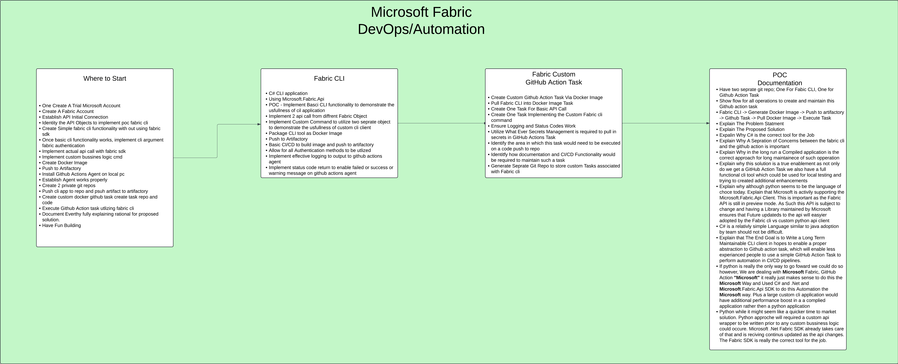

# Fabric Automation Project

This repository contains all the relevant information and resources for the Fabric Automation Project. The project aims to implement a C# CLI application using Microsoft.Fabric.Api to demonstrate the usefulness of CLI applications and to enable less experienced people to use a simple GitHub Action Task to perform automation in CI/CD pipelines.

## Project Overview

The above diagram provides an overview of the project, detailing the steps involved in creating and maintaining the GitHub action task.

## Proposed Architecture

The above diagram illustrates the proposed architecture solution for the project.

## Getting Started

Work in progress...