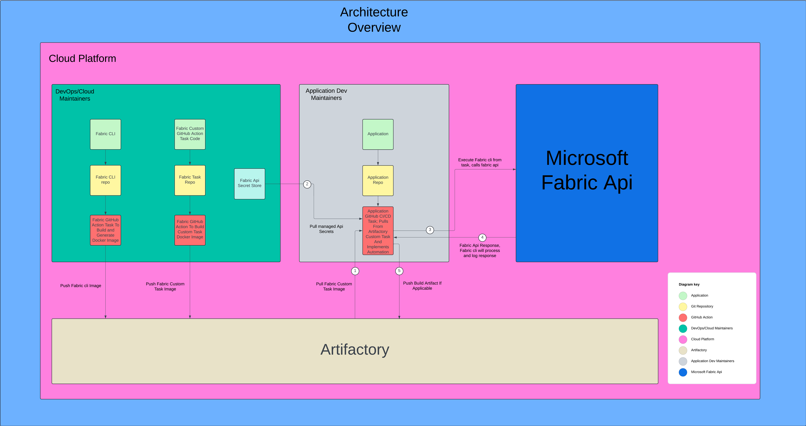
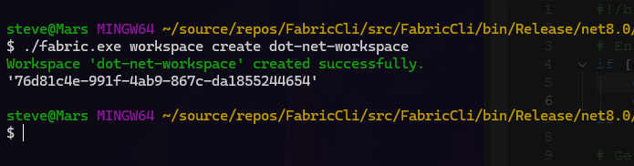
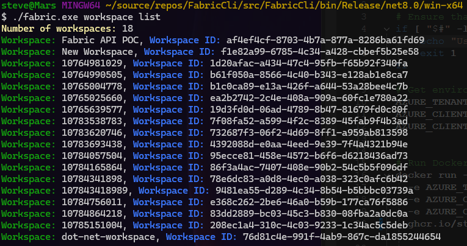

# Fabric Automation Project

This repository contains all the relevant information and resources for the Fabric Automation Project. The project aims to implement a C# CLI application using Microsoft.Fabric.Api to demonstrate the usefulness of CLI applications and to enable less experienced people to use a simple GitHub Action Task to perform automation in CI/CD pipelines.

## Proposed Architecture

The above diagram illustrates the proposed architecture solution for the project.

## Fabric CLI

Fabric CLI is a command-line interface tool built with C# and .NET 8.0, designed to interact with the Microsoft Fabric API. It provides a set of commands to manage workspaces, including creating new workspaces and listing all available workspaces.

For more details, please refer to the [Fabric CLI README](https://github.com/StevenBuglione/fabric-cli/blob/main/README.md) and the [associated GitHub Actions pipeline](https://github.com/StevenBuglione/fabric-cli/actions/runs/10784148604).

## Fabric CLI Action

This GitHub Action allows you to run Fabric CLI commands for Microsoft Fabric resources. It is designed to work with workspaces and can perform actions such as creating and listing workspaces.

For more details, please refer to the [Fabric CLI Action README](https://github.com/StevenBuglione/fabric-cli-action/blob/main/README.md)

## Fabric CLI Action Demo

This repository demonstrates how an external repository can reference and use the `StevenBuglione/fabric-cli-action@v1.0` GitHub Action. This action is designed to interact with the Microsoft Fabric API.

For more details, please refer to the [Fabric CLI Action Demo README](https://github.com/StevenBuglione/fabric-cli-application/blob/main/README.md) and the [associated GitHub Actions pipeline](https://github.com/StevenBuglione/fabric-cli-application/actions/runs/10785151004).

## License

This project is licensed under the terms of the MIT license.